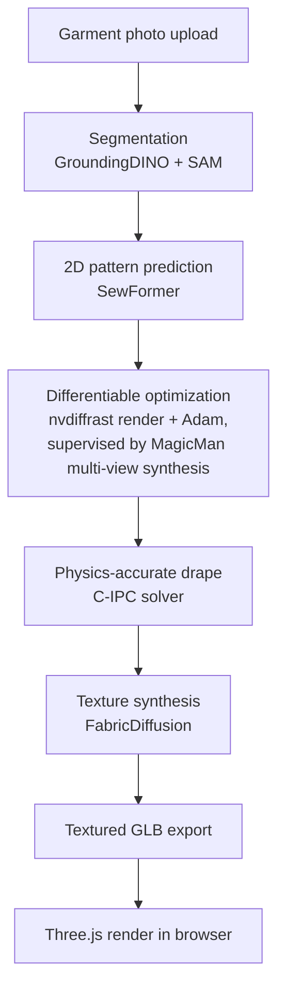

# Dress-1-to-3 Implementation

A production reimplementation of **Dress-1-to-3** ([arXiv:2502.03449](https://arxiv.org/abs/2502.03449)) — turning a single garment photo into a physically-accurate 3D drape on a real body, running end-to-end in a live web pipeline.

Built as the virtual fitting room engine for [HauteSync](https://hautesync.com), a personal style platform. I designed and built the full pipeline as Lead Developer.

> **Note on this repo:** this documents the system I built and the engineering decisions behind it. The production codebase itself is proprietary to HauteSync and is not included here. What's here is a technical writeup, architecture diagrams, and selected output examples.

---

## What it does

Upload a photo of a garment → get back a 3D model of that exact garment, correctly draped on your own body, viewable and rotatable in the browser. No manual 3D modeling, no generic size-chart guessing — the drape is derived from your actual measurements and a real cloth-physics simulation.

---

## Architecture

**Stage by stage:**

1. **Segmentation** — GroundingDINO + SAM isolate the garment from the background using open-vocabulary detection and zero-shot segmentation, not a hand-labeled classifier.
2. **2D pattern prediction** — a transformer (SewFormer) predicts an actual sewing pattern from the masked image: panel shapes, seams, and stitching topology. This is the hardest step conceptually — going from a flat pixel image to a structured, topologically-valid garment specification.
3. **Differentiable refinement** — the predicted pattern is refined against multi-view reference images using gradient descent *through a differentiable renderer* (nvdiffrast) with an Adam optimizer. The reference views themselves are synthesized by a diffusion model (MagicMan) hallucinating consistent side/back views from the single input photo — so the supervision signal for the optimization loop is itself the output of a second neural network.
4. **Physics-accurate draping** — a Codimensional Incremental Potential Contact (C-IPC) solver drapes the optimized pattern onto the user's body mesh. Most real-time cloth simulation only *discourages* the cloth from passing through the body via soft penalty forces, which can still fail visibly. C-IPC mathematically *guarantees* zero interpenetration. This replaced an earlier, faster XPBD simulation that's still used internally as a warm-start seed for the physics solve.
5. **Texture synthesis** — FabricDiffusion generates the surface material, baked into a textured GLB and rendered client-side with Three.js.

### Production system, not a research script

- **FastAPI + SQLite job queue** driving a single GPU worker, streaming live per-stage progress to the browser over Server-Sent Events — the user watches "predicting pattern → optimizing → draping → texturing" update in real time instead of staring at a spinner.
- **Automatic failure recovery** — a geometry-check step detects bad drapes (e.g. a chest-cropped garment) and falls back to a direct-parameter path that bypasses the learned predictor entirely, so a single bad prediction doesn't fail the whole job.
- **Cross-repo orchestration** — the pipeline coordinates five separate external research codebases (SewFormer, GarmentCode/pygarment, a custom Warp cloth-sim fork, OSX for SMPL-X body regression from photo, and MagicMan running in its own conda environment) into one coherent request/response flow, with real dependency and environment management across incompatible library versions.
- **Constrained hardware** — the whole pipeline runs in production on a single 24GB GPU (AWS g5.xlarge / A10G), which shapes real decisions about batching, precision, and what stays resident in VRAM.

---

## An engineering tradeoff worth calling out

I built and shipped **two** complete pipelines, not one:

- **Physics-accurate path** (above) — SewFormer + differentiable optimization + C-IPC drape. ~30-40 minutes per garment, but geometrically guaranteed correct.
- **Fast VLM-based path** — a vision-language model (LLaVA) describes the garment in words, and a much rougher drape is built from that description. ~7 minutes, materially less accurate.

The point isn't that one is "better" — it's that they trade off latency against fidelity in ways that matter for different situations (a live investor demo vs. a fitting result a user will actually rely on), and part of the job was building both and knowing when to reach for which.

---

## Tech stack

`SewFormer` · `GarmentCode / pygarment` · `nvdiffrast` (differentiable rendering) · `MagicMan` (multi-view diffusion synthesis) · `C-IPC` (ipc-toolkit, physics solver) · `FabricDiffusion` · `OSX` (SMPL-X body regression) · `FastAPI` · `React / Vite / Tailwind` · `Three.js` · `GroundingDINO` + `SAM`

---

## Results

See [`results/`](./results) for selected input → output examples.

---

## Reference

Zhang et al., *Dress-1-to-3: Single Image to Simulation-Ready 3D Outfit with Diffusion Prior and Differentiable Physics*, arXiv:2502.03449, 2025.

This repo documents an independent reimplementation and production extension of that paper's approach, built for HauteSync.
